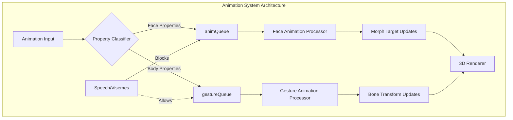
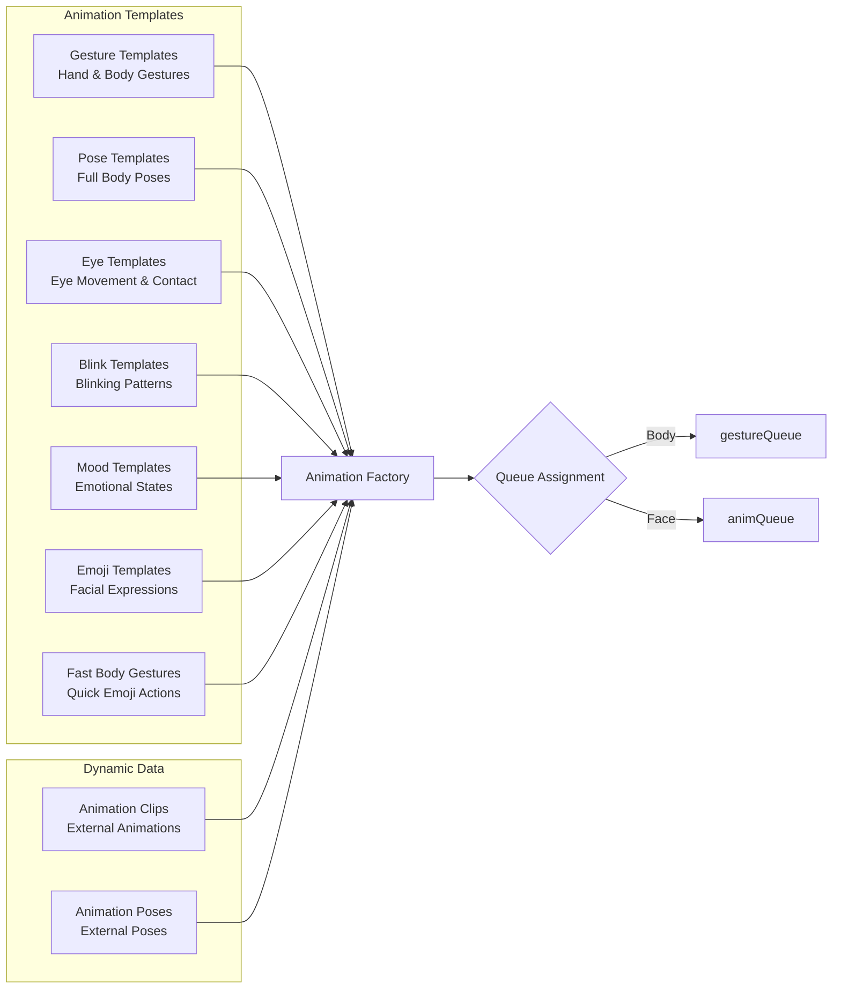
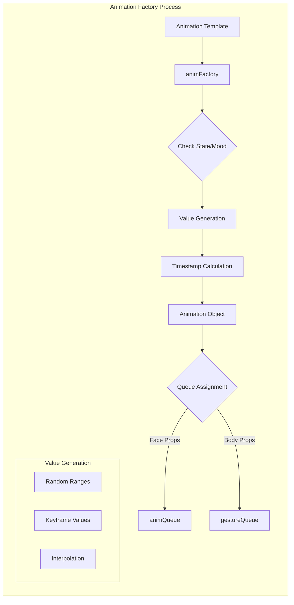
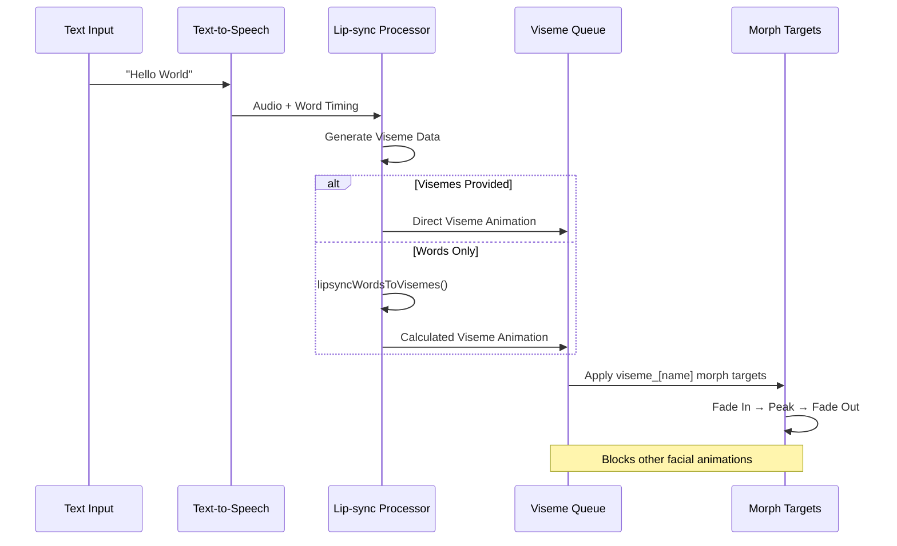
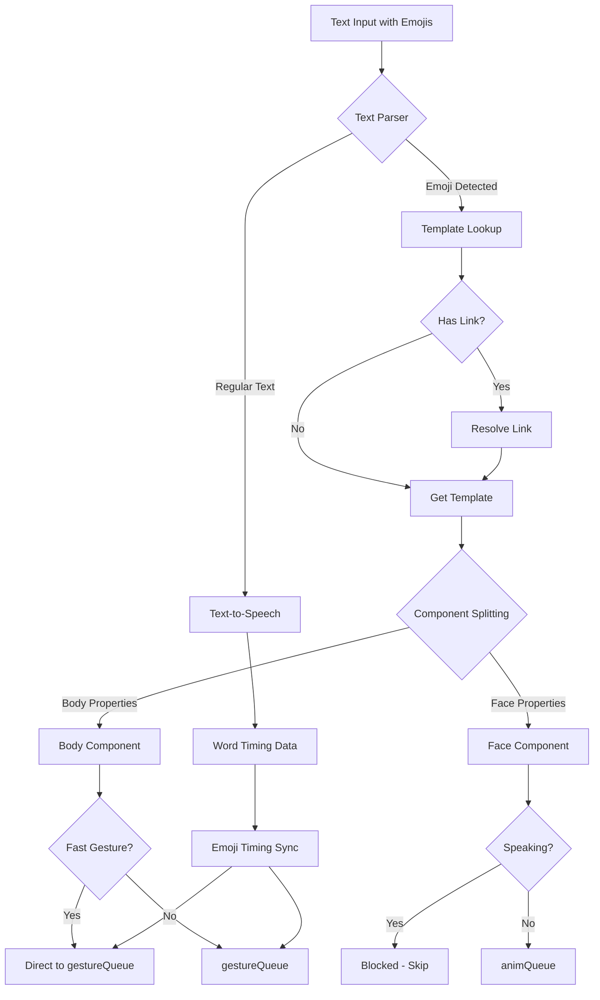
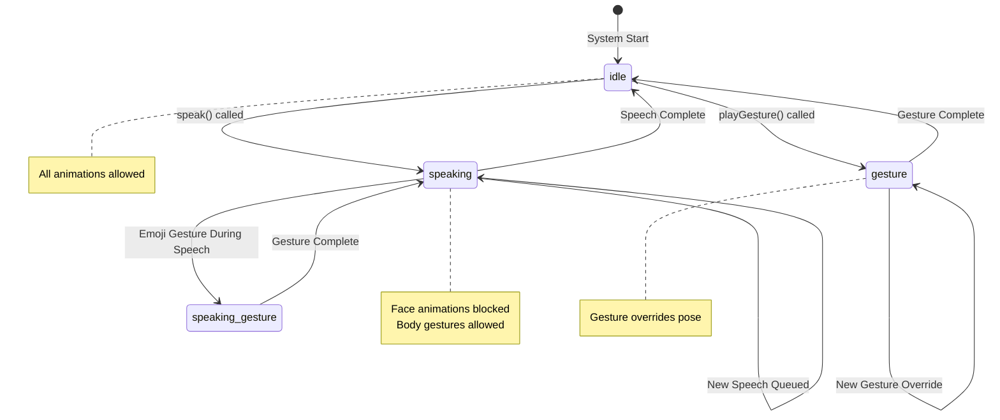
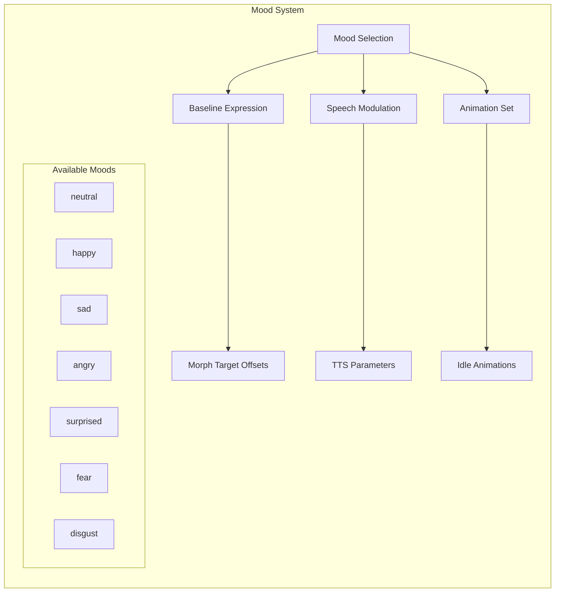

# TalkingHead Animation System

The TalkingHead animation system is a sophisticated multi-layered architecture that manages facial expressions, body gestures, poses, and speech synchronization through various template systems and animation queues.

## Architecture Overview

### Animation Processing Model

The system uses **parallel processing** with two main queues:
- **`animQueue`**: Face animations, visemes, subtitles, blendshapes
- **`gestureQueue`**: Body animations that run simultaneously with facial expressions



### Property Classification

Properties are classified for conflict management:

```javascript
// Body-only properties (safe during speech)
this.bodyOnlyProps = ['gesture', 'bodyRotateX', 'bodyRotateY', 'bodyRotateZ', 
                     'handLeft', 'handRight', 'handFistLeft', 'handFistRight'];

// Face properties that interfere with lip-sync  
this.faceBlockingProps = ['mouth', 'jaw', 'viseme_', 'tongue'];

// Face properties safe to use during speech
this.faceSafeProps = ['eyeContact', 'headMove', 'headRotateX', 'headRotateY', 
                     'headRotateZ', 'pose', 'eyeBlinkLeft', 'eyeBlinkRight', 
                     'bodyRotateX', 'bodyRotateZ'];
```

## Animation Template Systems



### 1. Gesture Templates (`this.gestureTemplates`)

Hand and body gesture definitions using bone rotations.

```javascript
this.gestureTemplates = {
  'handup': {
    'LeftShoulder.rotation': {x:[1.5,2,1,2], y:[0.2,0.4,1,2], z:[-1.5,-1.3,1,2]},
    'LeftArm.rotation': {x:[1.5,1.7,1,2], y:[-0.6,-0.4,1,2], z:[1,1.2,1,2]},
    // ... more bone rotations
  }
}
```

**Features:**
- Bone rotation keyframes with timing curves
- Left-hand focused (mirroring handled automatically)
- Used by `playGesture()` method

### 2. Pose Templates (`this.poseTemplates`)

Full-body pose definitions with complete skeletal positioning.

```javascript
this.poseTemplates = {
  'side': {
    standing: true,
    props: {
      'Hips.position': {x:0, y:1, z:0},
      'Hips.rotation': {x:-0.003, y:-0.017, z:0.1},
      // ... all bone transforms
    }
  }
}
```

**Features:**
- Complete skeletal transforms
- `standing` flag indicates weight distribution
- Used for character positioning and stance

### 3. Eye Animation Templates (`this.animTemplateEyes`)

Eye movement and contact behaviors.

```javascript
this.animTemplateEyes = { 
  name: 'eyes',
  idle: { alt: [
    {
      p: () => (avatar.avatarIdleEyeContact || opt.avatarIdleEyeContact),
      delay: [200,5000], 
      dt: [200,[2000,5000],[3000,10000,1,2]],
      vs: {
        headMove: [avatarIdleHeadMove],
        eyesRotateY: [[-0.6,0.6]], 
        eyesRotateX: [[-0.2,0.6]]
      }
    }
  ]}
}
```

### 4. Blink Templates (`this.animTemplateBlink`)

Blinking animation patterns with variations.

```javascript
this.animTemplateBlink = { 
  name: 'blink', 
  alt: [
    { p: 0.85, delay: [1000,8000,1,2], dt: [50,[100,300],100], 
      vs: { eyeBlinkLeft: [1,1,0], eyeBlinkRight: [1,1,0] } },
    { delay: [1000,4000,1,2], dt: [50,[100,200],100,[10,400,0],50,[100,200],100], 
      vs: { eyeBlinkLeft: [1,1,0,0,1,1,0], eyeBlinkRight: [1,1,0,0,1,1,0] } }
  ]
}
```

### 5. Mood Templates (`this.animMoods`)

Mood-based animation collections affecting baseline expressions and behaviors.

```javascript
this.animMoods = {
  'neutral': {
    baseline: { eyesLookDown: 0.1 },
    speech: { deltaRate: 0, deltaPitch: 0, deltaVolume: 0 },
    anims: [
      { name: 'breathing', delay: 1500, dt: [1200,500,1000], 
        vs: { chestInhale: [0.5,0.5,0] } },
      // ... more mood animations
    ]
  }
}
```

**Available Moods:**
- `neutral`, `happy`, `sad`, `angry`, `surprised`, `fear`, `disgust`

### 6. Emoji Templates (`this.animEmojis`)

Emoji-triggered facial expressions and gestures.

```javascript
this.animEmojis = {
  '😚': { 
    dt: [500,1000,1000], 
    rescale: [0,1,0], 
    vs: { 
      browInnerUp: [0.6], 
      eyeBlinkLeft: [1], 
      eyeBlinkRight: [1],
      mouthPucker: [0,0.5], 
      viseme_U: [0,1]  // Kiss lip shape
    } 
  }
}
```

### 7. Fast Body Gestures (`this.fastBodyGestures`)

Optimized body-only gesture emojis for quick processing during speech.

```javascript
this.fastBodyGestures = {
  '👉': { dt: [200,800], rescale: [0,1], vs: { gesture: [["pointright",2],null] } },
  '👈': { dt: [200,800], rescale: [0,1], vs: { gesture: [["pointleft",2],null] } },
  '👋': { dt: [200,800], rescale: [0,1], vs: { gesture: [["handup",2,true],null] } }
}
```

## Animation Template Structure

### Template Properties

```javascript
{
  name: 'animation_name',           // Template identifier
  delay: [min, max] | number,       // Random delay range or fixed delay (ms)
  dt: [time1, time2, ...],         // Delta times for keyframes (ms)
  rescale: [start, end],           // Value scaling range
  vs: {                            // Values object
    morphTarget: [val1, val2, ...], // Morph target keyframe values
    bone: [rotation_values, ...]    // Bone rotation keyframes
  },
  alt: [template1, template2, ...], // Alternative templates (random selection)
  p: probability | function,        // Selection probability (0-1)
  loop: boolean | number           // Loop count (true = infinite, number = count)
}
```

### Timing Arrays

- **`delay`**: `[min, max, weight1, weight2]` - Random delay with weighting
- **`dt`**: Delta times between keyframes in milliseconds
- **Range Values**: `[min, max, weight, power]` - Random value generation

### Value Interpolation

Values support multiple formats:
- **Single value**: `eyeBlinkLeft: [1]`
- **Keyframes**: `eyeBlinkLeft: [0, 1, 0]` (fade in, hold, fade out)
- **Ranges**: `eyesRotateY: [[-0.6, 0.6]]` (random between values)
- **Null placeholder**: `eyeBlinkLeft: [null, 1, 0]` (maintain current, then animate)

## Dynamic Animation System

### Animation Queues

**Main Animation Queue (`animQueue`)**:
- Facial expressions and morph targets
- Viseme lip-sync animations
- Subtitle displays
- Blendshape data

**Gesture Queue (`gestureQueue`)**:
- Body movements and hand gestures
- Runs in parallel with facial animations
- Filtered by `bodyOnlyProps` classification

### Animation Factory (`animFactory`)

Converts templates into executable animation objects:

```javascript
const anim = this.animFactory(template, loop, scaleTime, scaleValue, noClockOffset);
// Returns: { template, ts: [timestamps], vs: {property: [values]} }
```



### Processing Flow

1. **Template Selection**: Based on state, mood, probability
2. **Value Generation**: Random ranges, keyframe interpolation
3. **Queue Assignment**: Body vs. face property classification
4. **Parallel Execution**: Simultaneous processing of both queues
5. **Conflict Resolution**: Face-blocking properties during speech

## Viseme Integration

### Viseme Names
```javascript
this.visemeNames = [
  'aa', 'E', 'I', 'O', 'U', 'PP', 'SS', 'TH', 'DD', 'FF', 'kk',
  'nn', 'RR', 'CH', 'sil'
];
```

### Viseme Animation Structure
```javascript
{
  template: { name: 'viseme' },
  ts: [startTime, peakTime, endTime],
  vs: {
    ['viseme_' + visemeName]: [null, intensity, 0]
  }
}
```

### Lip-Sync Processing Flow



**Intensity Levels**:
- PP, FF visemes: 0.9
- Other visemes: 0.6 (with volume/overdrive adjustments)

## Emoji-to-Animation Logic

### Processing Pipeline



1. **Text Analysis**: Emoji detection during text processing
2. **Template Lookup**: `this.animEmojis[emoji]` or link resolution
3. **Component Splitting**: Separation into body and face components
4. **Queue Assignment**: 
   - Body parts → `gestureQueue` (can run during speech)
   - Face parts → `animQueue` (blocked during speech)
5. **Timing Synchronization**: Word-based timing for gesture emojis

### Fast Gesture Optimization

Common gesture emojis use `fastBodyGestures` for ultra-fast processing:
- Pre-computed body-only versions
- Faster timing (200-800ms vs 500-2000ms)
- Immediate queue insertion without splitting

## Morph Target System

### Built-in Morph Targets
- **ARKit Standard**: 52 facial expression blend shapes
- **Custom Extensions**: `mtCustoms` for body rotations, hand poses
- **RPM Extras**: `mtExtras` for missing ARKit blend shapes

### Morph Target Processing
```javascript
// Baseline values (idle expression)
this.mood.baseline = { eyesLookDown: 0.1 };

// Animation values (temporary changes)
vs: { eyeBlinkLeft: [1], mouthSmile: [0.7] }

// System updates (eye contact, head movement)
this.mtAvatar[morphTarget].system = value;
```

## Performance Optimizations

### Gesture Speed Control
```javascript
this.gestureSpeedMultiplier = 0.6; // 40% faster gestures
this.setGestureSpeed(multiplier);   // Runtime adjustment
```

### Animation Splitting
- **Body/Face Separation**: Allows parallel processing during speech
- **Fast Path**: Common gestures bypass complex processing
- **Conflict Prevention**: Property classification prevents lip-sync interference

### Memory Management
- **Template Reuse**: Single template → multiple animation instances
- **Queue Cleanup**: Automatic removal of completed animations
- **Link Resolution**: Emoji links prevent template duplication

## API Methods

### Gesture Control
```javascript
playGesture(name, duration, mirror, transitionMs)  // Play hand gesture or emoji
playGestureEmoji(emoji)                           // Body-only emoji gesture
stopGesture(transitionMs)                         // Stop current gesture
```

### Animation Control
```javascript
playAnimation(url, onProgress, duration, index, scale)  // Play external animation
playPose(url, onProgress, duration, index, scale)      // Apply external pose
setMood(moodName)                                       // Change mood animations
```

### Speech Integration
```javascript
speakEmoji(emoji)           // Add emoji to speech queue
speak(text, options)        // Text-to-speech with emoji processing
resetLips()                 // Reset all viseme morph targets
```

## State Management

### Animation States
- **idle**: Ambient animations, eye contact, breathing
- **speaking**: Speech-compatible animations, restrained movement
- **gesture**: Active gesture override state



### Mood Effects
- **Baseline**: Persistent facial expression offsets
- **Speech**: Voice modulation (rate, pitch, volume)
- **Animations**: Mood-specific ambient behaviors



### Conflict Resolution
- Face-blocking properties disabled during speech
- Gesture queue runs independently of speech
- Viseme animations override facial expressions
- Eye contact system integrates with head movement

---

This animation system provides a rich, multi-layered approach to character animation with sophisticated conflict management and performance optimizations for real-time avatar control.